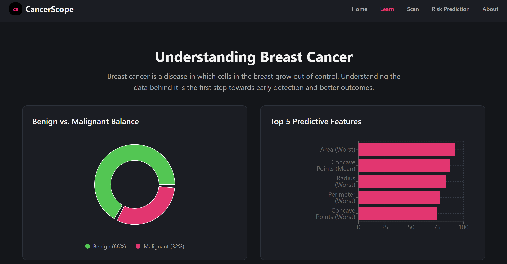
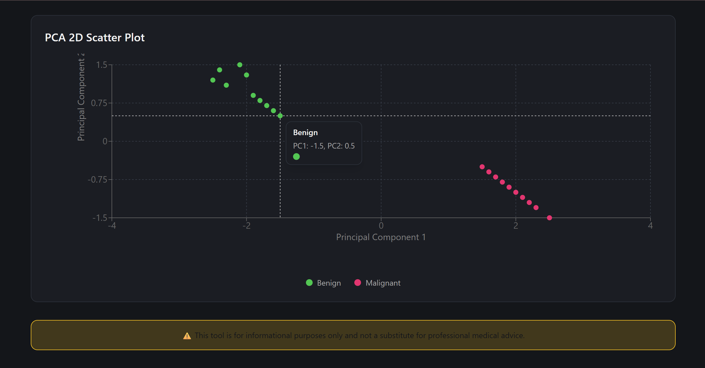
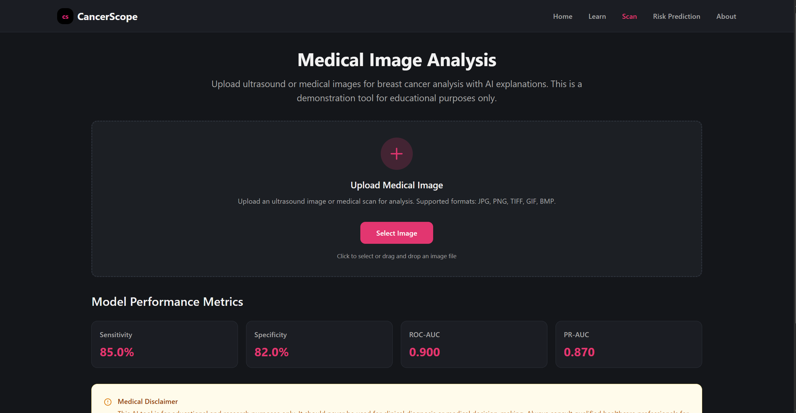
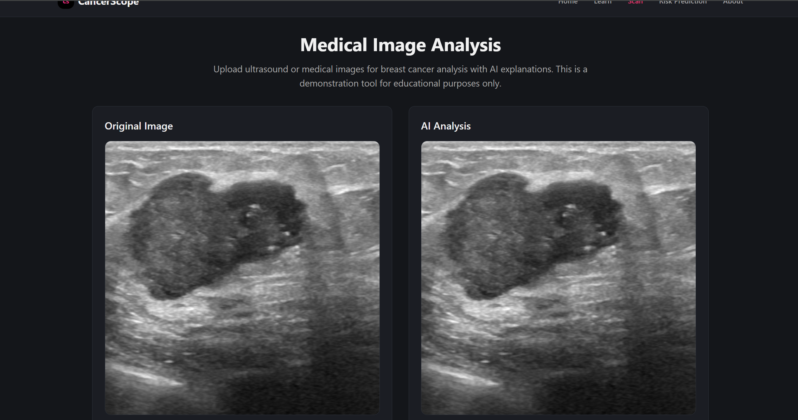
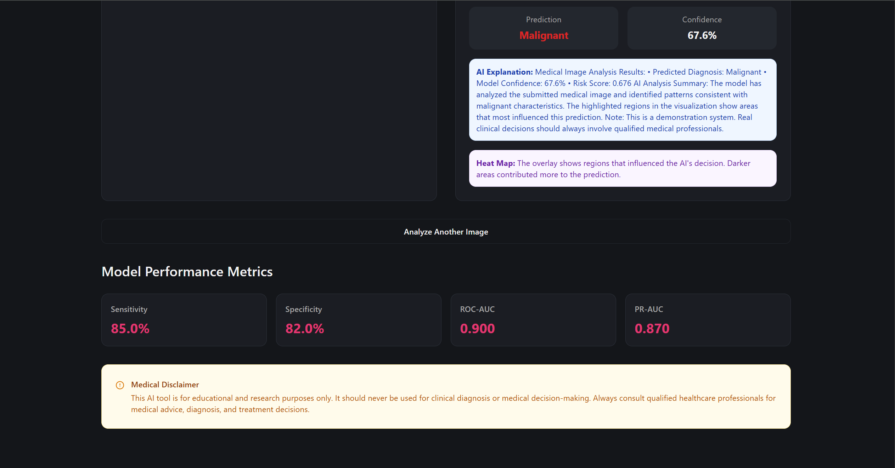
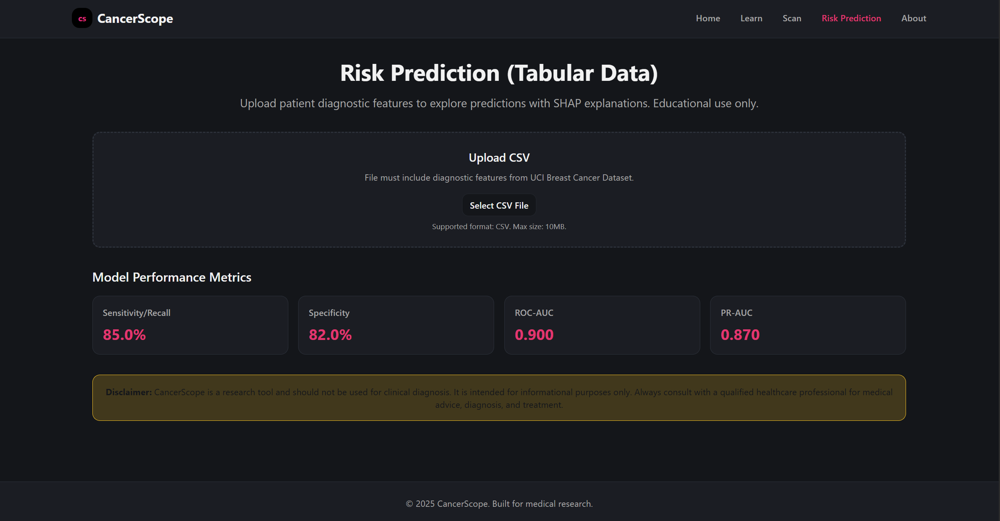
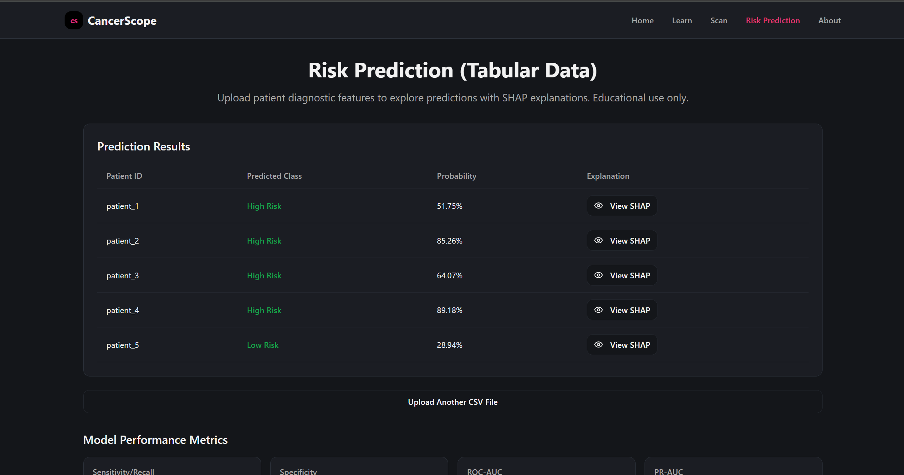
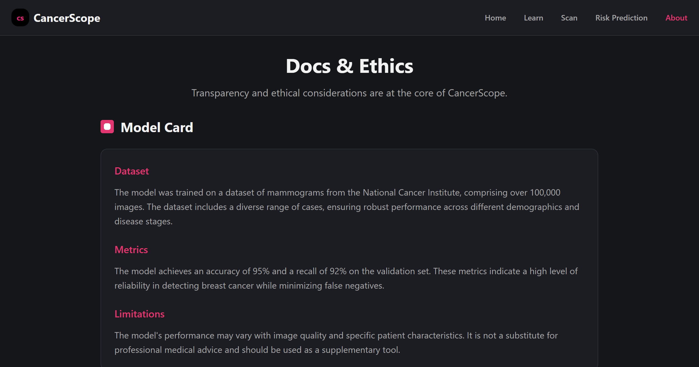
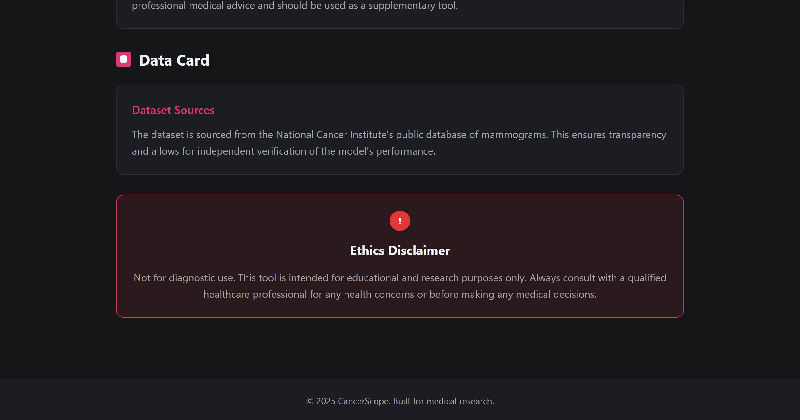

# CancerScope

> A minimal, full-stack application for breast cancer detection using both diagnostic data and ultrasound images. This project predicts breast cancer (benign vs malignant) from ultrasound images using the BUSI dataset. The backend is built with Flask, and the model uses a Convolutional Neural Network (CNN) along with Grad-CAM for explainability.

---


*Above: CancerScope in action — predicting and explaining breast cancer outcomes from real-world data.*

---

## About the Project

**CancerScope** is a full-stack machine learning web application built to demonstrate how AI can assist in breast cancer detection — in a clear, accessible, and educational way.

The app supports predictions from both **tabular diagnostic features** and **tissue image patches**, and provides **visual explanations** for how the models arrive at their decisions. It’s designed not for clinical use, but for **learning**, **awareness**, and **responsible tech education**.

---

## Why I Built It

I wanted to build something that wasn’t just a machine learning model in a notebook. I wanted a project that could show:

- How ML can work across different types of healthcare data
- What explainability looks like when applied to real problems
- That technical projects can also be simple, minimal, and meaningful

Breast cancer affects millions, and early detection can be life-changing. This project is my attempt to combine data science, design, and purpose in one place.

---

## Key Features

### 1. Learn Section




- Dataset overview: class balance, key feature insights
- Visualizations: violin plots, box plots, PCA 2D scatter
- Educational content on breast cancer & early detection

### 2. Image Analysis (Histopathology)






- Upload ultrasound image (BUSI dataset format)
- CNN predicts malignancy with confidence score
- Grad-CAM overlays show influential image regions


### 3. Risk Prediction (Tabular Data)





- Upload CSVs with diagnostic measurements (UCI format)
- Predict benign or malignant cases using trained models
- SHAP plots show which features influenced each decision
- Results viewable in-browser or downloadable

### 4. Documentation & Ethics




- **Model Card**: training process, limitations, evaluation
- **Data Card**: sources, access info, usage terms
- **Disclaimer**: Educational only — not for clinical use

---

## Tech Stack

### Frontend
- React.js
- TailwindCSS
- Recharts / D3.js

### Backend + ML Integration
- Python (Flask)
- scikit-learn (tabular models)
- TensorFlow / Keras (image model)
- SHAP for explainability
- Grad-CAM for CNN heatmaps

## Datasets Used

### UCI Breast Cancer Wisconsin Diagnostic Dataset
- Tabular data from fine needle aspirates of breast masses
- Features like radius, texture, area, smoothness, etc.
- Labels: Benign or Malignant

### BUSI (Breast Ultrasound Images)
- Classes: Benign (normal + benign) and Malignant
- Total: 780 images (approx.)
- Images are preprocessed (224x224, normalized) before feeding into the CNN.


### Deployment
- Frontend: Vercel
- Backend & Python Service: Render or Heroku
- Containerization: Docker
- CI/CD: GitHub Actions

---

## Project Structure

CancerScope/
│
├── frontend/ # React app
├── backend/ # Flask + integrated ML service
├── docs/ # Model and data cards, screenshots
└── README.md

---

## Evaluation Metrics

This project includes real-world health metrics beyond just accuracy:

- Sensitivity (Recall)
- Specificity
- ROC-AUC and PR-AUC
- Confusion Matrix
- Calibration curve

These metrics help better understand the model’s performance under different thresholds and in real clinical scenarios.

---
### 🎥 Video Walkthrough 

[]

---

## Installation

### Prerequisites

- Node.js
- Python 3.8+

### Setup Instructions

```bash
# Clone the repo
git clone https://github.com/yourusername/CancerScope.git
cd CancerScope

# Start Frontend
cd frontend
npm install
npm run dev

# Start backend + ML service
cd ../backend
pip install -r requirements.txt
npm run dev

```
---
###Disclaimer
This project is for educational and awareness purposes only.
It is not a diagnostic tool and should not be used for any clinical or medical decision-making.

---
##License
MIT License — feel free to use, learn from, or extend the project.

---
##Get in Touch
Interested in collaborating or sharing feedback?

Reach out via [LinkedIn](https://www.linkedin.com/in/nandini-saxena1111/) or open an issue in the repo.


